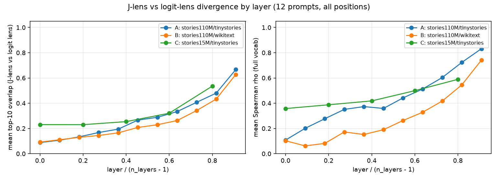

# J-lens on TinyStories models: feasibility report

Question: does a 12-layer whole-word-register TinyStories model (stories110M) produce mid-layer J-lens readouts that are legible and not reproducible by a plain logit lens? Secondary: stories15M gap, and TinyStories-fit vs WikiText-fit.

## Summary of findings

**Where the J-lens shows content the logit lens lacks (110M): layers 4-8.**
Top-10 overlap with the logit lens is 0.19-0.41 there (Spearman 0.37-0.60),
and the DIFF columns below are dominated by tokens the logit lens does not
have anywhere in its raw top-20. The readouts in that band are narrative
anticipation, not next-token guessing: "Ben broke the vase. He heard her
coming." reads ` hid / hide / hiding` at L6 while the logit lens shows only
sentence-starting pronouns; "It was a dark night..." reads ` shadow / noise /
investigate / secret / sound`; the persistent little bird reads ` Finally /
persistent / success / mistakes`; the apple/banana/cake prompt reads ` chose /
choose / Which`. Below L3 the J-lens output is garbage (` veg`, ` nation`,
` fixes` recur regardless of prompt) and by L9-L10 both lenses converge on the
model's actual output. **Recommended band: L4-L8 for stories110M, L2-L3 for
stories15M.**

**Is the divergence larger at 110M than 15M? Yes, substantially.** 15M has
only 5 fitted layers; its most divergent band (L2-L3, overlap 0.25-0.32)
already sits at the overlap level 110M reaches near its output layers, and its
mid-band content is surface-level (` hole / big / small / castle` on the
digging prompt) where 110M reads process and plan (` dig / buried / pit /
mole / deeper`). The 15M J-lens is still clearly better than its logit lens
(see the Lily table: ` Max` at J-rank 75 vs logit-rank 22198 while Lily is
active), but there is far less hidden mid-layer content to reveal.

**Does the in-register fit (A) beat the WikiText control (B)? Yes, but
modestly at mid layers.** A's readouts are somewhat cleaner (B admits more
out-of-register tokens like ` goal`, ` Y`, ` cos`) and A's Spearman curve sits
well above B's at every layer (e.g. L6: 0.44 vs 0.26), meaning A's full
readout distribution is more faithful to what the final layers actually keep.
The top-8 story content, however, largely survives the corpus swap - the fit
is not fragile. Note the per-prompt Jacobian norms during fitting: ~1.5 on
TinyStories vs ~3.2-4.6 on WikiText (the model is visibly out of register on
web text). Fit A is the one to ship; B proves the recipe isn't corpus-brittle.

**The Lily check passes on 110M.** With mid-layer J-lens readout, the
fragment ` L` is readable as the active-character marker at positions where
"Lily" is NOT the next token: after ` girl` (J rank 99 vs logit 2200), at
` L`/`ily` themselves (6 vs 1030, 24 vs 2343), and even on ` Max` (105 vs
1814). On prompt 8 the first token ` L` reads rank 6 under J vs 22308 under
logit. `ily` behaves as a pure continuation fragment (near rank 0 for both
lenses only immediately after ` L`) - so a whole-word app should display
multi-token names via their first piece, aggregating ` L` + following
fragment. Every name in the eval set (Lily, Max) was readable only via its
first piece at mid layers; whole-name tokens do not exist in this vocab.

**Fitting cost & saturation (feeds the WebGPU decision).** stories110M:
~5-7 s/prompt on an RTX A4000 (fp32, dim_batch 32; 96 backward passes per
prompt at d_model 768) -> 100 prompts in ~9 min, 1000 in ~105 min.
stories15M: ~0.2-0.3 s/prompt -> 100 prompts in 19 s, 1000 in 4.6 min.
Quality saturates fast, as the paper reports: cos(J_100, J_1000) = 0.991 (L2),
0.995 (L6), 0.999 (L9) on fit A, and the mid-layer filtered top-8 readouts
agree 82% across the two. **A 100-prompt fit is sufficient. In-browser
fitting is plausible for 15M (sub-minute even at 10x WebGPU slowdown) and
borderline for 110M (~9 GPU-min native; likely 30-90 min in-browser - ship
pre-fitted J matrices instead, ~25 MB fp16 for all 11 layers).**

**Acceptance criteria:** all three fits completed without NaNs and apply at
all layers (1); both models passed the fluency gate (2); the three questions
are answered above with examples (3); deliverables are listed at the end (4).

## Deviations from the brief / incident log

- `dim_batch=32` instead of the repo default 8, `checkpoint_every=25` instead
  of 1 - both pure performance knobs, estimator unchanged; recorded per fit
  in `config_*.json`.
- Fit B (100) crashed once with a native Windows abort (0xC0000409, cuBLAS
  context race at first backward pass, no Python traceback). Rerun with
  identical hyperparameters completed cleanly; results below are from that
  rerun. Subsequent chain steps had one logged retry-with-resume available
  but none was needed.
- The 110M `max_position_embeddings` is 1024 in the Xenova conversion (brief
  said seq 256); irrelevant at seq_len 128, all other config fields match.
- Corpus selection is deterministic (first N eligible items in dataset order
  at a pinned revision) rather than seeded-random; recorded in `out/pins.json`
  and the corpus JSONs.

## Setup and fluency gate

- **stories110M** = `Xenova/llama2.c-stories110M` @ `9a520bc089`, 12 layers, d_model 768, fp32 on NVIDIA RTX A4000; torch 2.5.1+cu121, transformers 5.13.1.
- **stories15M** = `Xenova/llama2.c-stories15M` @ `17c2f1eabe`, 6 layers, d_model 288, fp32 on NVIDIA RTX A4000; torch 2.5.1+cu121, transformers 5.13.1.

Greedy completions of "Once upon a time" (gate: fluent TinyStories prose):

**stories110M:**

> Once upon a time, there was a little girl named Lily. She loved to play outside in the sunshine. One day, she saw a big, red apple on a tree. She wanted to eat it, but it was too high up.
Lily asked her friend, a little bird, "Can you help me get the apple?"
The bird said, "Sure, I can fly up and get it for you."
The bird flew up to the apple and pecked it off the tree. Lily was so happy and took a big bite. But then,

**stories15M:**

> Once upon a time, there was a little girl named Lily. She loved to play outside in the sunshine. One day, she saw a big, red ball in the sky. It was the sun! She thought it was so pretty.
Lily wanted to play with the ball, but it was too high up in the sky. She tried to jump and reach it, but she couldn't. Then, she had an idea. She would use a stick to knock the ball down.
Lily found a stick and tried to hit the ball. But the stick was too short. She

## Fitting wall-clock

| fit | model | corpus | n_prompts | wall-clock | s/prompt | hardware |
|---|---|---|---|---|---|---|
| A | stories110M | tinystories | 100 | 515 s | 5.15 | NVIDIA RTX A4000 |
| A | stories110M | tinystories | 1000 | 6327 s | 6.33 | NVIDIA RTX A4000 |
| B | stories110M | wikitext | 100 | 548 s | 5.48 | NVIDIA RTX A4000 |
| B | stories110M | wikitext | 1000 | 6805 s | 6.8 | NVIDIA RTX A4000 |
| C | stories15M | tinystories | 100 | 19 s | 0.19 | NVIDIA RTX A4000 |
| C | stories15M | tinystories | 1000 | 278 s | 0.28 | NVIDIA RTX A4000 |

## Where the J-lens diverges from the logit lens

**Fit A** (stories110M, tinystories): L0: overlap 0.09 / rho 0.11; L1: overlap 0.11 / rho 0.20; L2: overlap 0.13 / rho 0.28; L3: overlap 0.17 / rho 0.35; L4: overlap 0.19 / rho 0.37; L5: overlap 0.27 / rho 0.36; L6: overlap 0.29 / rho 0.44; L7: overlap 0.33 / rho 0.51; L8: overlap 0.41 / rho 0.60; L9: overlap 0.48 / rho 0.72; L10: overlap 0.67 / rho 0.83

**Fit B** (stories110M, wikitext): L0: overlap 0.09 / rho 0.10; L1: overlap 0.11 / rho 0.06; L2: overlap 0.13 / rho 0.08; L3: overlap 0.14 / rho 0.17; L4: overlap 0.17 / rho 0.15; L5: overlap 0.21 / rho 0.19; L6: overlap 0.23 / rho 0.26; L7: overlap 0.26 / rho 0.33; L8: overlap 0.34 / rho 0.42; L9: overlap 0.43 / rho 0.55; L10: overlap 0.63 / rho 0.74

**Fit C** (stories15M, tinystories): L0: overlap 0.23 / rho 0.36; L1: overlap 0.23 / rho 0.39; L2: overlap 0.25 / rho 0.42; L3: overlap 0.32 / rho 0.50; L4: overlap 0.54 / rho 0.59

## Fit A (stories110M, fit on tinystories, lens_1000.pt): top-8 readouts at the last position

### Prompt 1: "Once upon a time there was a little girl named Lily. She had a dog named Max. One day"

Model's actual next-token top-5: `,`, ` L`, ` they`, ` Max`, ` she`

| band (layer) | J-lens top-8 (filtered) | logit-lens top-8 (filtered) | DIFF (J-only) |
|---|---|---|---|
| early (L2) | ` while`, ` shorter`, ` short`, ` long`, ` lower`, ` near`, ` stranger`, ` surprise` | ` day`, ` while`, ` at`, ` on`, ` long`, ` was`, ` he`, ` when` | ` shorter*`, ` short*`, ` lower*`, ` near*`, ` stranger*`, ` surprise*` |
| mid (L6) | ` while`, ` decide`, ` unusual`, ` when`, ` long`, ` two`, ` choose`, ` decided` | ` while`, ` was`, ` when`, ` it`, ` a`, ` on`, ` they`, ` he` | ` decide*`, ` unusual*`, ` long`, ` two`, ` choose*`, ` decided*` |
| late (L9) | ` while`, ` Max`, ` L`, ` they`, ` when`, ` two`, ` decide`, ` Mitt` | ` they`, ` while`, ` when`, ` L`, ` Max`, ` it`, ` she`, ` at` | ` two`, ` decide*`, ` Mitt*` |

### Prompt 2: "Tom saw a big dark cloud in the sky. He kept playing outside."

Model's actual next-token top-5: ` Sud`, ` He`, ` Then`, ` His`, ` So`

| band (layer) | J-lens top-8 (filtered) | logit-lens top-8 (filtered) | DIFF (J-only) |
|---|---|---|---|
| early (L2) | ` veg`, ` Y`, ` shoot`, ` Then`, ` shed`, ` nation`, ` prayer`, ` year` | ` The`, ` It`, ` He`, ` But`, ` One`, ` They`, ` His`, ` A` | ` veg*`, ` Y*`, ` shoot*`, ` Then`, ` shed*`, ` nation*`, ` prayer*`, ` year*` |
| mid (L6) | ` Sud`, ` He`, ` M`, ` Then`, ` wet`, ` grass`, ` wind`, ` shot` | ` He`, ` Sud`, ` The`, ` It`, ` One`, ` His`, ` But`, ` Then` | ` M`, ` wet*`, ` grass*`, ` wind*`, ` shot*` |
| late (L9) | ` Sud`, ` Then`, ` When`, ` suddenly`, ` soon`, ` The`, ` He`, ` But` | ` Sud`, ` He`, ` The`, ` But`, ` Then`, ` His`, ` When`, ` It` | ` suddenly`, ` soon*` |

### Prompt 3: "Sara put her red ball in the box. Then she went to eat lunch. When she came back"

Model's actual next-token top-5: `,`, ` she`, ` to`, ` from`, ` the`

| band (layer) | J-lens top-8 (filtered) | logit-lens top-8 (filtered) | DIFF (J-only) |
|---|---|---|---|
| early (L2) | ` forth`, ` stronger`, ` kid`, ` marriage`, ` home`, ` forg`, ` entrance`, ` bo` | ` to`, ` up`, ` from`, ` home`, ` inside`, ` outside`, ` with`, ` at` | ` forth*`, ` stronger*`, ` kid*`, ` marriage*`, ` forg*`, ` entrance*`, ` bo*` |
| mid (L6) | ` later`, ` again`, ` finished`, ` home`, ` another`, ` next`, ` missing`, ` carrying` | ` later`, ` to`, ` with`, ` home`, ` at`, ` from`, ` soon`, ` suggesting` | ` again*`, ` finished*`, ` another*`, ` next*`, ` missing*`, ` carrying` |
| late (L9) | ` later`, ` after`, ` burst`, ` home`, ` afterwards`, ` to`, ` soon`, ` she` | ` to`, ` later`, ` in`, ` with`, ` from`, ` and`, ` after`, ` the` | ` burst*`, ` home`, ` afterwards*`, ` soon`, ` she` |

### Prompt 4: "Ben broke his mom's favorite vase. He heard her coming."

Model's actual next-token top-5: ` He`, ` Ben`, `<0x0A>`, ` "`, ` When`

| band (layer) | J-lens top-8 (filtered) | logit-lens top-8 (filtered) | DIFF (J-only) |
|---|---|---|---|
| early (L2) | ` veg`, ` Then`, ` cos`, ` nation`, ` shed`, ` fixes`, ` cr`, ` odd` | ` It`, ` The`, ` He`, ` But`, ` They`, ` She`, ` One`, ` His` | ` veg*`, ` Then`, ` cos*`, ` nation*`, ` shed*`, ` fixes*`, ` cr*`, ` odd*` |
| mid (L6) | ` hid`, ` M`, ` He`, ` hide`, ` She`, ` first`, ` shed`, ` hiding` | ` He`, ` She`, ` It`, ` The`, ` When`, ` His`, ` But`, ` M` | ` hid`, ` hide*`, ` first*`, ` shed*`, ` hiding*` |
| late (L9) | ` He`, ` hid`, ` She`, ` Quick`, ` When`, ` hide`, ` hiding`, ` His` | ` He`, ` She`, ` When`, ` It`, ` hid`, ` The`, ` His`, ` Quick` | ` hide`, ` hiding*` |

### Prompt 5: "Anna was very hungry. She looked in the kitchen and saw an apple, a banana, and a cake."

Model's actual next-token top-5: ` She`, ` But`, ` The`, ` They`, ` Her`

| band (layer) | J-lens top-8 (filtered) | logit-lens top-8 (filtered) | DIFF (J-only) |
|---|---|---|---|
| early (L2) | ` woods`, ` goal`, ` thro`, ` cave`, ` bear`, ` SN`, ` ig`, ` word` | ` She`, ` The`, ` It`, ` He`, ` They`, ` But`, ` One`, ` M` | ` woods*`, ` goal*`, ` thro*`, ` cave*`, ` bear*`, ` SN*`, ` ig*`, ` word*` |
| mid (L6) | ` She`, ` What`, ` M`, ` Then`, ` chose`, ` what`, ` also`, ` Where` | ` She`, ` He`, ` It`, ` The`, ` But`, ` They`, ` M`, ` What` | ` Then`, ` chose*`, ` what*`, ` also*`, ` Where*` |
| late (L9) | ` She`, ` dec`, ` Which`, ` Those`, ` What`, ` which`, ` choose`, ` Where` | ` She`, ` He`, ` The`, ` But`, ` What`, ` It`, ` M`, ` They` | ` dec*`, ` Which`, ` Those*`, ` which`, ` choose*`, ` Where` |

### Prompt 6: "The little bird could not fly. Every day it tried and tried."

Model's actual next-token top-5: ` But`, ` One`, ` It`, ` The`, ` Then`

| band (layer) | J-lens top-8 (filtered) | logit-lens top-8 (filtered) | DIFF (J-only) |
|---|---|---|---|
| early (L2) | ` veg`, ` year`, ` soft`, ` prop`, ` nation`, ` vict`, ` distant`, ` fixes` | ` The`, ` He`, ` One`, ` It`, ` But`, ` She`, ` His`, ` They` | ` veg*`, ` year*`, ` soft*`, ` prop*`, ` nation*`, ` vict*`, ` distant*`, ` fixes*` |
| mid (L6) | ` Finally`, ` finally`, ` One`, ` mi`, ` its`, ` persistent`, ` success`, ` mistakes` | ` One`, ` It`, ` The`, ` But`, ` He`, ` At`, ` She`, ` its` | ` Finally`, ` finally*`, ` mi*`, ` persistent*`, ` success*`, ` mistakes*` |
| late (L9) | ` One`, ` Finally`, ` But`, ` its`, ` Every`, ` one`, ` Day`, ` It` | ` One`, ` But`, ` It`, ` Every`, ` The`, ` Finally`, ` He`, ` Then` | ` its`, ` one*`, ` Day*` |

### Prompt 7: "First Anna put on her socks, then her shoes, then"

Model's actual next-token top-5: ` her`, ` she`, ` finally`, ` one`, ` the`

| band (layer) | J-lens top-8 (filtered) | logit-lens top-8 (filtered) | DIFF (J-only) |
|---|---|---|---|
| early (L2) | ` bow`, ` paused`, ` reverse`, ` cu`, ` pause`, ` territory`, ` bell`, ` pav` | ` went`, ` she`, ` ran`, ` they`, ` he`, ` one`, ` h`, ` cu` | ` bow*`, ` paused*`, ` reverse*`, ` pause*`, ` territory*`, ` bell*`, ` pav*` |
| mid (L6) | ` everything`, ` third`, ` she`, ` Oh`, ` more`, ` finally`, ` completely`, ` paused` | ` she`, ` he`, ` her`, ` a`, ` the`, ` they`, ` even`, ` h` | ` everything*`, ` third*`, ` Oh*`, ` more*`, ` finally*`, ` completely*`, ` paused*` |
| late (L9) | ` her`, ` she`, ` finally`, ` even`, ` everything`, ` hers`, ` herself`, ` head` | ` her`, ` she`, ` the`, ` a`, ` even`, ` it`, ` his`, ` they` | ` finally`, ` everything`, ` hers*`, ` herself*`, ` head*` |

### Prompt 8: "Lily and Max went to the beach. Lily built a castle. Max dug a"

Model's actual next-token top-5: ` hole`, ` big`, ` deep`, ` mo`, ` p`

| band (layer) | J-lens top-8 (filtered) | logit-lens top-8 (filtered) | DIFF (J-only) |
|---|---|---|---|
| early (L2) | ` hum`, ` mo`, ` Wo`, ` qu`, ` earned`, ` Ro`, ` calm`, ` d` | ` big`, ` very`, ` little`, ` small`, ` long`, ` lot`, ` happy`, ` nice` | ` hum*`, ` mo*`, ` Wo*`, ` qu*`, ` earned*`, ` Ro*`, ` calm*`, ` d*` |
| mid (L6) | ` dig`, ` mo`, ` hole`, ` buried`, ` sand`, ` pit`, ` mole`, ` deeper` | ` big`, ` hole`, ` sand`, ` deep`, ` pretty`, ` t`, ` few`, ` c` | ` dig*`, ` mo`, ` buried*`, ` pit*`, ` mole*`, ` deeper*` |
| late (L9) | ` dig`, ` mo`, ` hole`, ` sand`, ` buried`, ` pit`, ` castle`, ` mud` | ` hole`, ` sand`, ` big`, ` mo`, ` dig`, ` deep`, ` bucket`, ` castle` | ` buried*`, ` pit`, ` mud` |

### Prompt 9: "It was a dark night. Tim heard a strange noise in the garden."

Model's actual next-token top-5: ` He`, ` It`, `<0x0A>`, ` His`, ` "`

| band (layer) | J-lens top-8 (filtered) | logit-lens top-8 (filtered) | DIFF (J-only) |
|---|---|---|---|
| early (L2) | ` nation`, ` veg`, ` It`, ` fixes`, ` sle`, ` grows`, ` future`, ` safety` | ` It`, ` He`, ` The`, ` She`, ` They`, ` A`, ` His`, ` One` | ` nation*`, ` veg*`, ` fixes*`, ` sle*`, ` grows*`, ` future*`, ` safety*` |
| mid (L6) | ` He`, ` shadow`, ` It`, ` Sud`, ` noise`, ` investigate`, ` secret`, ` sound` | ` He`, ` It`, ` She`, ` The`, ` A`, ` His`, ` Sud`, ` What` | ` shadow*`, ` noise`, ` investigate*`, ` secret*`, ` sound*` |
| late (L9) | ` He`, ` It`, ` She`, ` What`, ` curious`, ` Cur`, ` Sud`, ` His` | ` He`, ` It`, ` She`, ` His`, ` What`, ` When`, ` M`, ` Sud` | ` curious*`, ` Cur*` |

### Prompt 10: "Mia planted a tiny seed. She watered it every day. After many days"

Model's actual next-token top-5: `,`, ` the`, ` it`, ` of`, ` she`

| band (layer) | J-lens top-8 (filtered) | logit-lens top-8 (filtered) | DIFF (J-only) |
|---|---|---|---|
| early (L2) | ` weeks`, ` longer`, ` spare`, ` routine`, ` months`, ` hours`, ` days`, ` lip` | ` long`, ` as`, ` and`, ` on`, ` until`, ` ahead`, ` away`, ` at` | ` weeks*`, ` longer`, ` spare*`, ` routine*`, ` months*`, ` hours*`, ` days*`, ` lip*` |
| mid (L6) | ` longer`, ` weeks`, ` finally`, ` long`, ` of`, ` ago`, ` sun`, ` progress` | ` of`, ` until`, ` and`, ` long`, ` sun`, ` on`, ` as`, ` what` | ` longer*`, ` weeks*`, ` finally*`, ` ago`, ` progress*` |
| late (L9) | ` of`, ` ago`, ` passed`, ` she`, ` progress`, ` grew`, ` rose`, ` died` | ` of`, ` she`, ` it`, ` he`, ` and`, ` there`, ` in`, ` passed` | ` ago`, ` progress*`, ` grew*`, ` rose*`, ` died*` |

### Prompt 11: "The dragon was not mean. He was just lonely."

Model's actual next-token top-5: ` He`, ` One`, ` The`, ` His`, ` No`

| band (layer) | J-lens top-8 (filtered) | logit-lens top-8 (filtered) | DIFF (J-only) |
|---|---|---|---|
| early (L2) | ` setup`, ` means`, ` included`, ` increased`, ` Now`, ` now`, ` space`, ` veg` | ` The`, ` One`, ` He`, ` But`, ` It`, ` They`, ` His`, ` A` | ` setup*`, ` means*`, ` included*`, ` increased*`, ` Now*`, ` now*`, ` space*`, ` veg*` |
| mid (L6) | ` He`, ` available`, ` Every`, ` One`, ` Some`, ` needed`, ` So`, ` cheap` | ` He`, ` The`, ` One`, ` His`, ` But`, ` It`, ` She`, ` So` | ` available*`, ` Every`, ` Some`, ` needed`, ` cheap*` |
| late (L9) | ` He`, ` One`, ` The`, ` Every`, ` No`, ` She`, ` lon`, ` His` | ` He`, ` One`, ` The`, ` His`, ` She`, ` Every`, ` It`, ` But` | ` No`, ` lon` |

### Prompt 12: "Sam had three cookies. He gave one to his sister."

Model's actual next-token top-5: ` She`, ` His`, ` They`, ` It`, ` "`

| band (layer) | J-lens top-8 (filtered) | logit-lens top-8 (filtered) | DIFF (J-only) |
|---|---|---|---|
| early (L2) | ` nation`, ` Then`, ` prince`, ` cos`, ` comp`, ` fixes`, ` veg`, ` year` | ` The`, ` It`, ` He`, ` They`, ` She`, ` But`, ` One`, ` His` | ` nation*`, ` Then`, ` prince*`, ` cos*`, ` comp*`, ` fixes*`, ` veg*`, ` year*` |
| mid (L6) | ` Then`, ` They`, ` She`, ` M`, ` distant`, ` first`, ` He`, ` D` | ` She`, ` It`, ` They`, ` He`, ` Then`, ` The`, ` But`, ` One` | ` M`, ` distant*`, ` first*`, ` D` |
| late (L9) | ` They`, ` Then`, ` His`, ` The`, ` He`, ` But`, ` She`, ` It` | ` They`, ` It`, ` He`, ` The`, ` She`, ` But`, ` His`, ` Then` | (none) |

## Fit B (stories110M, fit on wikitext, lens_1000.pt): top-8 readouts at the last position

### Prompt 1: "Once upon a time there was a little girl named Lily. She had a dog named Max. One day"

Model's actual next-token top-5: `,`, ` L`, ` they`, ` Max`, ` she`

| band (layer) | J-lens top-8 (filtered) | logit-lens top-8 (filtered) | DIFF (J-only) |
|---|---|---|---|
| early (L2) | ` news`, ` something`, ` appears`, ` Day`, ` announced`, ` morning`, ` knock`, ` surprise` | ` day`, ` while`, ` at`, ` on`, ` long`, ` was`, ` he`, ` when` | ` news*`, ` something*`, ` appears*`, ` Day*`, ` announced*`, ` morning*`, ` knock*`, ` surprise*` |
| mid (L6) | ` two`, ` decided`, ` while`, ` morning`, ` something`, ` decide`, ` a`, ` knock` | ` while`, ` was`, ` when`, ` it`, ` a`, ` on`, ` they`, ` he` | ` two`, ` decided*`, ` morning*`, ` something*`, ` decide*`, ` knock*` |
| late (L9) | ` Max`, ` while`, ` two`, ` L`, ` decide`, ` Mitt`, ` dog`, ` talking` | ` they`, ` while`, ` when`, ` L`, ` Max`, ` it`, ` she`, ` at` | ` two`, ` decide*`, ` Mitt*`, ` dog*`, ` talking*` |

### Prompt 2: "Tom saw a big dark cloud in the sky. He kept playing outside."

Model's actual next-token top-5: ` Sud`, ` He`, ` Then`, ` His`, ` So`

| band (layer) | J-lens top-8 (filtered) | logit-lens top-8 (filtered) | DIFF (J-only) |
|---|---|---|---|
| early (L2) | ` cr`, ` He`, ` veg`, ` One`, ` Then`, ` ro`, ` A`, ` six` | ` The`, ` It`, ` He`, ` But`, ` One`, ` They`, ` His`, ` A` | ` cr`, ` veg*`, ` Then`, ` ro*`, ` six*` |
| mid (L6) | ` Sud`, ` He`, ` goal`, ` One`, ` Y`, ` wet`, ` wind`, ` too` | ` He`, ` Sud`, ` The`, ` It`, ` One`, ` His`, ` But`, ` Then` | ` goal*`, ` Y*`, ` wet*`, ` wind*`, ` too*` |
| late (L9) | ` Sud`, ` He`, ` Then`, ` When`, ` But`, ` suddenly`, ` The`, ` His` | ` Sud`, ` He`, ` The`, ` But`, ` Then`, ` His`, ` When`, ` It` | ` suddenly` |

### Prompt 3: "Sara put her red ball in the box. Then she went to eat lunch. When she came back"

Model's actual next-token top-5: `,`, ` she`, ` to`, ` from`, ` the`

| band (layer) | J-lens top-8 (filtered) | logit-lens top-8 (filtered) | DIFF (J-only) |
|---|---|---|---|
| early (L2) | ` forth`, ` again`, ` returning`, ` home`, ` stronger`, ` faster`, ` restored`, ` reverse` | ` to`, ` up`, ` from`, ` home`, ` inside`, ` outside`, ` with`, ` at` | ` forth*`, ` again*`, ` returning*`, ` stronger*`, ` faster*`, ` restored*`, ` reverse*` |
| mid (L6) | ` later`, ` next`, ` home`, ` again`, ` returning`, ` finished`, ` still`, ` tom` | ` later`, ` to`, ` with`, ` home`, ` at`, ` from`, ` soon`, ` suggesting` | ` next*`, ` again*`, ` returning*`, ` finished*`, ` still*`, ` tom` |
| late (L9) | ` later`, ` after`, ` to`, ` home`, ` running`, ` burst`, ` afterwards`, ` carrying` | ` to`, ` later`, ` in`, ` with`, ` from`, ` and`, ` after`, ` the` | ` home`, ` running*`, ` burst*`, ` afterwards*`, ` carrying*` |

### Prompt 4: "Ben broke his mom's favorite vase. He heard her coming."

Model's actual next-token top-5: ` He`, ` Ben`, `<0x0A>`, ` "`, ` When`

| band (layer) | J-lens top-8 (filtered) | logit-lens top-8 (filtered) | DIFF (J-only) |
|---|---|---|---|
| early (L2) | ` cr`, ` Then`, ` Sure`, ` OK`, ` veg`, ` But`, ` fixes`, ` one` | ` It`, ` The`, ` He`, ` But`, ` They`, ` She`, ` One`, ` His` | ` cr*`, ` Then`, ` Sure*`, ` OK*`, ` veg*`, ` fixes*`, ` one*` |
| mid (L6) | ` He`, ` M`, ` hid`, ` mess`, ` Quick`, ` quietly`, ` silence`, ` She` | ` He`, ` She`, ` It`, ` The`, ` When`, ` His`, ` But`, ` M` | ` hid`, ` mess*`, ` Quick*`, ` quietly*`, ` silence*` |
| late (L9) | ` He`, ` hid`, ` Quick`, ` His`, ` he`, ` hiding`, ` hide`, ` When` | ` He`, ` She`, ` When`, ` It`, ` hid`, ` The`, ` His`, ` Quick` | ` he*`, ` hiding*`, ` hide` |

### Prompt 5: "Anna was very hungry. She looked in the kitchen and saw an apple, a banana, and a cake."

Model's actual next-token top-5: ` She`, ` But`, ` The`, ` They`, ` Her`

| band (layer) | J-lens top-8 (filtered) | logit-lens top-8 (filtered) | DIFF (J-only) |
|---|---|---|---|
| early (L2) | ` word`, ` scri`, ` popular`, ` On`, ` goal`, ` confident`, ` Although`, ` horror` | ` She`, ` The`, ` It`, ` He`, ` They`, ` But`, ` One`, ` M` | ` word*`, ` scri*`, ` popular*`, ` On*`, ` goal*`, ` confident*`, ` Although*`, ` horror*` |
| mid (L6) | ` chose`, ` What`, ` what`, ` She`, ` everything`, ` she`, ` choose`, ` wanted` | ` She`, ` He`, ` It`, ` The`, ` But`, ` They`, ` M`, ` What` | ` chose*`, ` what*`, ` everything*`, ` she`, ` choose*`, ` wanted*` |
| late (L9) | ` She`, ` Which`, ` choose`, ` What`, ` Those`, ` dec`, ` chose`, ` which` | ` She`, ` He`, ` The`, ` But`, ` What`, ` It`, ` M`, ` They` | ` Which`, ` choose*`, ` Those*`, ` dec*`, ` chose*`, ` which` |

### Prompt 6: "The little bird could not fly. Every day it tried and tried."

Model's actual next-token top-5: ` But`, ` One`, ` It`, ` The`, ` Then`

| band (layer) | J-lens top-8 (filtered) | logit-lens top-8 (filtered) | DIFF (J-only) |
|---|---|---|---|
| early (L2) | ` soft`, ` scri`, ` He`, ` word`, ` stood`, ` One`, ` gl`, ` scra` | ` The`, ` He`, ` One`, ` It`, ` But`, ` She`, ` His`, ` They` | ` soft*`, ` scri*`, ` word*`, ` stood*`, ` gl*`, ` scra*` |
| mid (L6) | ` One`, ` But`, ` persistent`, ` success`, ` goal`, ` wanted`, ` Every`, ` It` | ` One`, ` It`, ` The`, ` But`, ` He`, ` At`, ` She`, ` its` | ` persistent*`, ` success*`, ` goal*`, ` wanted*`, ` Every` |
| late (L9) | ` But`, ` One`, ` It`, ` Finally`, ` Every`, ` but`, ` trying`, ` its` | ` One`, ` But`, ` It`, ` Every`, ` The`, ` Finally`, ` He`, ` Then` | ` but*`, ` trying*`, ` its` |

### Prompt 7: "First Anna put on her socks, then her shoes, then"

Model's actual next-token top-5: ` her`, ` she`, ` finally`, ` one`, ` the`

| band (layer) | J-lens top-8 (filtered) | logit-lens top-8 (filtered) | DIFF (J-only) |
|---|---|---|---|
| early (L2) | ` again`, ` la`, ` reverse`, ` history`, ` begin`, ` enemies`, ` realized`, ` bow` | ` went`, ` she`, ` ran`, ` they`, ` he`, ` one`, ` h`, ` cu` | ` again*`, ` la*`, ` reverse*`, ` history*`, ` begin*`, ` enemies*`, ` realized*`, ` bow*` |
| mid (L6) | ` la`, ` pret`, ` finally`, ` third`, ` again`, ` everything`, ` something`, ` she` | ` she`, ` he`, ` her`, ` a`, ` the`, ` they`, ` even`, ` h` | ` la*`, ` pret*`, ` finally*`, ` third*`, ` again*`, ` everything*`, ` something` |
| late (L9) | ` her`, ` she`, ` finally`, ` even`, ` everything`, ` backwards`, ` head`, ` herself` | ` her`, ` she`, ` the`, ` a`, ` even`, ` it`, ` his`, ` they` | ` finally`, ` everything`, ` backwards*`, ` head*`, ` herself*` |

### Prompt 8: "Lily and Max went to the beach. Lily built a castle. Max dug a"

Model's actual next-token top-5: ` hole`, ` big`, ` deep`, ` mo`, ` p`

| band (layer) | J-lens top-8 (filtered) | logit-lens top-8 (filtered) | DIFF (J-only) |
|---|---|---|---|
| early (L2) | ` deep`, ` a`, ` A`, ` as`, ` history`, ` an`, ` un`, ` victory` | ` big`, ` very`, ` little`, ` small`, ` long`, ` lot`, ` happy`, ` nice` | ` deep*`, ` a*`, ` A*`, ` as*`, ` history*`, ` an*`, ` un*`, ` victory*` |
| mid (L6) | ` dig`, ` mo`, ` sand`, ` hole`, ` buried`, ` pit`, ` deeper`, ` giant` | ` big`, ` hole`, ` sand`, ` deep`, ` pretty`, ` t`, ` few`, ` c` | ` dig*`, ` mo`, ` buried*`, ` pit*`, ` deeper*`, ` giant*` |
| late (L9) | ` mo`, ` dig`, ` hole`, ` sand`, ` buried`, ` pit`, ` tunnel`, ` castle` | ` hole`, ` sand`, ` big`, ` mo`, ` dig`, ` deep`, ` bucket`, ` castle` | ` buried*`, ` pit`, ` tunnel` |

### Prompt 9: "It was a dark night. Tim heard a strange noise in the garden."

Model's actual next-token top-5: ` He`, ` It`, `<0x0A>`, ` His`, ` "`

| band (layer) | J-lens top-8 (filtered) | logit-lens top-8 (filtered) | DIFF (J-only) |
|---|---|---|---|
| early (L2) | ` one`, ` means`, ` One`, ` scri`, ` Every`, ` word`, ` included`, ` cr` | ` It`, ` He`, ` The`, ` She`, ` They`, ` A`, ` His`, ` One` | ` one*`, ` means*`, ` scri*`, ` Every`, ` word*`, ` included*`, ` cr*` |
| mid (L6) | ` He`, ` noise`, ` rh`, ` shadow`, ` sound`, ` strange`, ` mus`, ` Sud` | ` He`, ` It`, ` She`, ` The`, ` A`, ` His`, ` Sud`, ` What` | ` noise`, ` rh*`, ` shadow*`, ` sound*`, ` strange*`, ` mus*` |
| late (L9) | ` He`, ` It`, ` His`, ` he`, ` What`, ` Sud`, ` curious`, ` Cur` | ` He`, ` It`, ` She`, ` His`, ` What`, ` When`, ` M`, ` Sud` | ` he`, ` curious*`, ` Cur*` |

### Prompt 10: "Mia planted a tiny seed. She watered it every day. After many days"

Model's actual next-token top-5: `,`, ` the`, ` it`, ` of`, ` she`

| band (layer) | J-lens top-8 (filtered) | logit-lens top-8 (filtered) | DIFF (J-only) |
|---|---|---|---|
| early (L2) | ` days`, ` weeks`, ` months`, ` longer`, ` spare`, ` week`, ` routine`, ` long` | ` long`, ` as`, ` and`, ` on`, ` until`, ` ahead`, ` away`, ` at` | ` days*`, ` weeks*`, ` months*`, ` longer`, ` spare*`, ` week*`, ` routine*` |
| mid (L6) | ` weeks`, ` months`, ` long`, ` days`, ` until`, ` ago`, ` sun`, ` wait` | ` of`, ` until`, ` and`, ` long`, ` sun`, ` on`, ` as`, ` what` | ` weeks*`, ` months*`, ` days`, ` ago`, ` wait*` |
| late (L9) | ` ago`, ` of`, ` passed`, ` progress`, ` he`, ` she`, ` grew`, ` there` | ` of`, ` she`, ` it`, ` he`, ` and`, ` there`, ` in`, ` passed` | ` ago`, ` progress*`, ` grew*` |

### Prompt 11: "The dragon was not mean. He was just lonely."

Model's actual next-token top-5: ` He`, ` One`, ` The`, ` His`, ` No`

| band (layer) | J-lens top-8 (filtered) | logit-lens top-8 (filtered) | DIFF (J-only) |
|---|---|---|---|
| early (L2) | ` means`, ` one`, ` One`, ` included`, ` team`, ` includes`, ` Like`, ` He` | ` The`, ` One`, ` He`, ` But`, ` It`, ` They`, ` His`, ` A` | ` means*`, ` one*`, ` included*`, ` team*`, ` includes*`, ` Like*` |
| mid (L6) | ` He`, ` Every`, ` he`, ` needed`, ` wanted`, ` all`, ` alone`, ` two` | ` He`, ` The`, ` One`, ` His`, ` But`, ` It`, ` She`, ` So` | ` Every`, ` he*`, ` needed`, ` wanted*`, ` all*`, ` alone*`, ` two*` |
| late (L9) | ` He`, ` One`, ` he`, ` The`, ` Every`, ` His`, ` lon`, ` No` | ` He`, ` One`, ` The`, ` His`, ` She`, ` Every`, ` It`, ` But` | ` he`, ` lon`, ` No` |

### Prompt 12: "Sam had three cookies. He gave one to his sister."

Model's actual next-token top-5: ` She`, ` His`, ` They`, ` It`, ` "`

| band (layer) | J-lens top-8 (filtered) | logit-lens top-8 (filtered) | DIFF (J-only) |
|---|---|---|---|
| early (L2) | ` one`, ` prince`, ` cr`, ` Then`, ` vict`, ` horse`, ` One`, ` unf` | ` The`, ` It`, ` He`, ` They`, ` She`, ` But`, ` One`, ` His` | ` one*`, ` prince*`, ` cr*`, ` Then`, ` vict*`, ` horse*`, ` unf*` |
| mid (L6) | ` Then`, ` goal`, ` Y`, ` then`, ` Every`, ` They`, ` Next`, ` He` | ` She`, ` It`, ` They`, ` He`, ` Then`, ` The`, ` But`, ` One` | ` goal*`, ` Y*`, ` then`, ` Every`, ` Next*` |
| late (L9) | ` He`, ` His`, ` They`, ` The`, ` Then`, ` But`, ` It`, ` Every` | ` They`, ` It`, ` He`, ` The`, ` She`, ` But`, ` His`, ` Then` | ` Every` |

## Fit C (stories15M, fit on tinystories, lens_1000.pt): top-8 readouts at the last position

### Prompt 1: "Once upon a time there was a little girl named Lily. She had a dog named Max. One day"

Model's actual next-token top-5: `,`, ` L`, ` they`, ` Max`, ` she`

| band (layer) | J-lens top-8 (filtered) | logit-lens top-8 (filtered) | DIFF (J-only) |
|---|---|---|---|
| early (L1) | ` outside`, ` news`, ` weather`, ` fle`, ` something`, ` flying`, ` surprise`, ` chance` | ` day`, ` afternoon`, ` the`, ` morning`, ` when`, ` in`, ` there`, ` chance` | ` outside*`, ` news*`, ` weather*`, ` fle*`, ` something*`, ` flying*`, ` surprise*` |
| mid (L3) | ` something`, ` she`, ` while`, ` he`, ` when`, ` noticed`, ` Uncle`, ` D` | ` when`, ` a`, ` she`, ` something`, ` it`, ` he`, ` day`, ` while` | ` noticed*`, ` Uncle*`, ` D*` |
| late (L4) | ` they`, ` she`, ` he`, ` while`, ` D`, ` when`, ` there`, ` something` | ` they`, ` she`, ` he`, ` when`, ` it`, ` while`, ` there`, ` the` | ` D*`, ` something` |

### Prompt 2: "Tom saw a big dark cloud in the sky. He kept playing outside."

Model's actual next-token top-5: ` He`, ` His`, ` But`, ` Sud`, ` "`

| band (layer) | J-lens top-8 (filtered) | logit-lens top-8 (filtered) | DIFF (J-only) |
|---|---|---|---|
| early (L1) | ` M`, ` He`, ` he`, ` She`, ` The`, ` It`, ` They`, ` mom` | ` very`, ` and`, ` The`, ` He`, ` first`, ` It`, ` When`, ` She` | ` M*`, ` he*`, ` They*`, ` mom*` |
| mid (L3) | ` He`, ` She`, ` But`, ` The`, ` Sud`, ` M`, ` Then`, ` They` | ` It`, ` The`, ` But`, ` He`, ` When`, ` She`, ` One`, ` but` | ` Sud`, ` M`, ` Then`, ` They` |
| late (L4) | ` He`, ` His`, ` he`, ` But`, ` his`, ` Sud`, ` She`, ` It` | ` He`, ` His`, ` She`, ` But`, ` It`, ` The`, ` Sud`, ` his` | ` he` |

### Prompt 3: "Sara put her red ball in the box. Then she went to eat lunch. When she came back"

Model's actual next-token top-5: `,`, ` to`, ` out`, ` she`, ` from`

| band (layer) | J-lens top-8 (filtered) | logit-lens top-8 (filtered) | DIFF (J-only) |
|---|---|---|---|
| early (L1) | ` again`, ` back`, ` after`, ` with`, ` returned`, ` before`, ` later`, ` next` | ` back`, ` home`, ` at`, ` down`, ` another`, ` returned`, ` return`, ` screen` | ` again`, ` after*`, ` with*`, ` before*`, ` later*`, ` next*` |
| mid (L3) | ` home`, ` outside`, ` to`, ` from`, ` back`, ` with`, ` Max`, ` Sam` | ` to`, ` home`, ` outside`, ` at`, ` early`, ` smile`, ` laugh`, ` down` | ` from`, ` back*`, ` with*`, ` Max*`, ` Sam*` |
| late (L4) | ` to`, ` from`, ` out`, ` with`, ` she`, ` outside`, ` home`, ` later` | ` from`, ` to`, ` out`, ` home`, ` with`, ` at`, ` she`, ` outside` | ` later*` |

### Prompt 4: "Ben broke his mom's favorite vase. He heard her coming."

Model's actual next-token top-5: ` He`, ` She`, ` It`, ` "`, ` They`

| band (layer) | J-lens top-8 (filtered) | logit-lens top-8 (filtered) | DIFF (J-only) |
|---|---|---|---|
| early (L1) | ` M`, ` He`, ` They`, ` The`, ` She`, ` night`, ` forever`, ` Baby` | ` and`, ` very`, ` too`, ` It`, ` She`, ` with`, ` The`, ` first` | ` M*`, ` He`, ` They*`, ` night*`, ` forever*`, ` Baby*` |
| mid (L3) | ` She`, ` He`, ` It`, ` The`, ` They`, ` Anna`, ` Ben`, ` L` | ` It`, ` She`, ` The`, ` He`, ` and`, ` the`, ` When`, ` it` | ` They`, ` Anna*`, ` Ben*`, ` L*` |
| late (L4) | ` He`, ` She`, ` They`, ` His`, ` It`, ` The`, ` But`, ` he` | ` He`, ` It`, ` She`, ` The`, ` His`, ` They`, ` But`, ` curious` | ` he` |

### Prompt 5: "Anna was very hungry. She looked in the kitchen and saw an apple, a banana, and a cake."

Model's actual next-token top-5: ` She`, ` But`, `<0x0A>`, ` The`, ` Where`

| band (layer) | J-lens top-8 (filtered) | logit-lens top-8 (filtered) | DIFF (J-only) |
|---|---|---|---|
| early (L1) | ` M`, ` She`, ` Then`, ` The`, ` Sud`, ` But`, ` match`, ` Tw` | ` The`, ` He`, ` She`, ` It`, ` When`, ` for`, ` How`, ` very` | ` M*`, ` Then*`, ` Sud*`, ` But*`, ` match*`, ` Tw*` |
| mid (L3) | ` He`, ` She`, ` But`, ` It`, ` The`, ` They`, ` There`, ` Anna` | ` She`, ` He`, ` It`, ` The`, ` But`, ` They`, ` but`, ` Then` | ` There`, ` Anna*` |
| late (L4) | ` She`, ` But`, ` He`, ` Her`, ` They`, ` The`, ` There`, ` It` | ` She`, ` But`, ` He`, ` The`, ` Her`, ` It`, ` They`, ` What` | ` There` |

### Prompt 6: "The little bird could not fly. Every day it tried and tried."

Model's actual next-token top-5: ` But`, ` It`, ` Then`, ` One`, ` The`

| band (layer) | J-lens top-8 (filtered) | logit-lens top-8 (filtered) | DIFF (J-only) |
|---|---|---|---|
| early (L1) | ` He`, ` he`, ` him`, ` M`, ` His`, ` The`, ` shr`, ` asking` | ` The`, ` He`, ` It`, ` When`, ` She`, ` His`, ` Sud`, ` cool` | ` he*`, ` him*`, ` M*`, ` shr*`, ` asking*` |
| mid (L3) | ` He`, ` But`, ` Then`, ` She`, ` Every`, ` Sud`, ` The`, ` His` | ` He`, ` The`, ` It`, ` She`, ` One`, ` But`, ` When`, ` Then` | ` Every*`, ` Sud`, ` His` |
| late (L4) | ` It`, ` its`, ` But`, ` Its`, ` itself`, ` it`, ` The`, ` Every` | ` It`, ` its`, ` itself`, ` Its`, ` But`, ` Then`, ` The`, ` Every` | ` it` |

### Prompt 7: "First Anna put on her socks, then her shoes, then"

Model's actual next-token top-5: ` her`, ` she`, ` on`, ` to`, ` the`

| band (layer) | J-lens top-8 (filtered) | logit-lens top-8 (filtered) | DIFF (J-only) |
|---|---|---|---|
| early (L1) | ` then`, ` three`, ` or`, ` again`, ` finally`, ` twice`, ` slide`, ` another` | ` then`, ` they`, ` she`, ` Then`, ` something`, ` pair`, ` some`, ` so` | ` three`, ` or*`, ` again*`, ` finally*`, ` twice*`, ` slide*`, ` another*` |
| mid (L3) | ` she`, ` they`, ` he`, ` and`, ` jump`, ` so`, ` all`, ` gro` | ` forward`, ` onto`, ` left`, ` she`, ` sit`, ` so`, ` coat`, ` free` | ` they*`, ` he`, ` and*`, ` jump*`, ` all*`, ` gro*` |
| late (L4) | ` her`, ` she`, ` hers`, ` his`, ` put`, ` sho`, ` handed`, ` ran` | ` her`, ` she`, ` his`, ` put`, ` hers`, ` coat`, ` so`, ` on` | ` sho*`, ` handed*`, ` ran` |

### Prompt 8: "Lily and Max went to the beach. Lily built a castle. Max dug a"

Model's actual next-token top-5: ` hole`, ` big`, ` tunnel`, ` small`, ` deep`

| band (layer) | J-lens top-8 (filtered) | logit-lens top-8 (filtered) | DIFF (J-only) |
|---|---|---|---|
| early (L1) | ` sound`, ` who`, ` noise`, ` sal`, ` film`, ` voice`, ` reply`, ` song` | ` big`, ` huge`, ` small`, ` loud`, ` beautiful`, ` new`, ` tiny`, ` perfect` | ` sound*`, ` who*`, ` noise*`, ` sal*`, ` film*`, ` voice*`, ` reply*`, ` song*` |
| mid (L3) | ` hole`, ` big`, ` small`, ` castle`, ` holes`, ` tiny`, ` fort`, ` thin` | ` big`, ` new`, ` small`, ` few`, ` good`, ` bigger`, ` lot`, ` great` | ` hole*`, ` castle*`, ` holes*`, ` tiny*`, ` fort*`, ` thin*` |
| late (L4) | ` hole`, ` tunnel`, ` big`, ` cave`, ` pit`, ` bigger`, ` sand`, ` dig` | ` big`, ` new`, ` deep`, ` good`, ` bigger`, ` hole`, ` small`, ` dark` | ` tunnel*`, ` cave*`, ` pit*`, ` sand*`, ` dig*` |

### Prompt 9: "It was a dark night. Tim heard a strange noise in the garden."

Model's actual next-token top-5: ` He`, ` It`, ` Sud`, ` "`, ` His`

| band (layer) | J-lens top-8 (filtered) | logit-lens top-8 (filtered) | DIFF (J-only) |
|---|---|---|---|
| early (L1) | ` M`, ` She`, ` spark`, ` He`, ` she`, ` It`, ` match`, ` The` | ` and`, ` She`, ` with`, ` He`, ` It`, ` The`, ` very`, ` in` | ` M*`, ` spark*`, ` she*`, ` match*` |
| mid (L3) | ` She`, ` He`, ` Sud`, ` It`, ` The`, ` There`, ` His`, ` Little` | ` It`, ` He`, ` She`, ` The`, ` When`, ` out`, ` Sud`, ` a` | ` There*`, ` His`, ` Little*` |
| late (L4) | ` He`, ` His`, ` It`, ` he`, ` Sud`, ` The`, ` She`, ` But` | ` He`, ` It`, ` She`, ` His`, ` The`, ` When`, ` Sud`, ` But` | ` he` |

### Prompt 10: "Mia planted a tiny seed. She watered it every day. After many days"

Model's actual next-token top-5: `,`, ` of`, ` and`, ` she`, `.`

| band (layer) | J-lens top-8 (filtered) | logit-lens top-8 (filtered) | DIFF (J-only) |
|---|---|---|---|
| early (L1) | ` days`, ` months`, ` weeks`, ` every`, ` years`, ` each`, ` week`, ` hours` | ` days`, ` day`, ` weeks`, ` season`, ` hours`, ` sun`, ` week`, ` evening` | ` months`, ` every*`, ` years*`, ` each*` |
| mid (L3) | ` months`, ` days`, ` of`, ` weeks`, ` week`, ` season`, ` each`, ` grew` | ` of`, ` and`, ` came`, ` at`, ` quar`, ` in`, ` on`, ` days` | ` months`, ` weeks*`, ` week*`, ` season*`, ` each*`, ` grew*` |
| late (L4) | ` of`, ` but`, ` after`, ` and`, ` for`, ` at`, ` until`, ` about` | ` of`, ` day`, ` passed`, ` season`, ` and`, ` at`, ` after`, ` but` | ` for`, ` until*`, ` about` |

### Prompt 11: "The dragon was not mean. He was just lonely."

Model's actual next-token top-5: ` He`, ` One`, ` Every`, ` The`, ` But`

| band (layer) | J-lens top-8 (filtered) | logit-lens top-8 (filtered) | DIFF (J-only) |
|---|---|---|---|
| early (L1) | ` He`, ` M`, ` spark`, ` he`, ` They`, ` button`, ` The`, ` It` | ` for`, ` The`, ` When`, ` She`, ` He`, ` It`, ` cool`, ` l` | ` M*`, ` spark*`, ` he*`, ` They*`, ` button*` |
| mid (L3) | ` He`, ` Every`, ` She`, ` One`, ` But`, ` All`, ` The`, ` His` | ` He`, ` It`, ` One`, ` She`, ` The`, ` When`, ` But`, ` m` | ` Every`, ` All*`, ` His` |
| late (L4) | ` He`, ` Every`, ` His`, ` One`, ` he`, ` But`, ` All`, ` The` | ` He`, ` It`, ` One`, ` But`, ` She`, ` The`, ` His`, ` Every` | ` he`, ` All` |

### Prompt 12: "Sam had three cookies. He gave one to his sister."

Model's actual next-token top-5: ` His`, ` She`, ` It`, ` The`, ` He`

| band (layer) | J-lens top-8 (filtered) | logit-lens top-8 (filtered) | DIFF (J-only) |
|---|---|---|---|
| early (L1) | ` M`, ` He`, ` The`, ` They`, ` he`, ` It`, ` She`, ` mom` | ` The`, ` When`, ` and`, ` when`, ` very`, ` It`, ` He`, ` She` | ` M*`, ` They*`, ` he*`, ` mom*` |
| mid (L3) | ` The`, ` It`, ` But`, ` He`, ` She`, ` They`, ` Sud`, ` Then` | ` It`, ` The`, ` He`, ` But`, ` When`, ` but`, ` She`, ` sit` | ` They`, ` Sud*`, ` Then` |
| late (L4) | ` He`, ` His`, ` The`, ` But`, ` They`, ` It`, ` his`, ` Then` | ` The`, ` His`, ` It`, ` He`, ` But`, ` Then`, ` They`, ` She` | ` his` |

DIFF = tokens in the J-lens filtered top-8 that are absent from the logit-lens filtered top-8; `*` = also absent from the logit lens's raw top-20.

## A vs B: TinyStories fit vs WikiText fit (same model)

**Prompt 6:** "The little bird could not fly. Every day it tried and tried." (mid band, L6)

| lens | J-lens top-8 (filtered) |
|---|---|
| A (TinyStories fit) | ` Finally`, ` finally`, ` One`, ` mi`, ` its`, ` persistent`, ` success`, ` mistakes` |
| B (WikiText fit) | ` One`, ` But`, ` persistent`, ` success`, ` goal`, ` wanted`, ` Every`, ` It` |

**Prompt 11:** "The dragon was not mean. He was just lonely." (mid band, L6)

| lens | J-lens top-8 (filtered) |
|---|---|
| A (TinyStories fit) | ` He`, ` available`, ` Every`, ` One`, ` Some`, ` needed`, ` So`, ` cheap` |
| B (WikiText fit) | ` He`, ` Every`, ` he`, ` needed`, ` wanted`, ` all`, ` alone`, ` two` |

**Prompt 12:** "Sam had three cookies. He gave one to his sister." (mid band, L6)

| lens | J-lens top-8 (filtered) |
|---|---|
| A (TinyStories fit) | ` Then`, ` They`, ` She`, ` M`, ` distant`, ` first`, ` He`, ` D` |
| B (WikiText fit) | ` Then`, ` goal`, ` Y`, ` then`, ` Every`, ` They`, ` Next`, ` He` |

## A vs C: 110M vs 15M (both TinyStories fit)

**Prompt 1:** "Once upon a time there was a little girl named Lily. She had a dog named Max. One day"

| model | mid-band J-lens top-8 (filtered) |
|---|---|
| stories110M (L6) | ` while`, ` decide`, ` unusual`, ` when`, ` long`, ` two`, ` choose`, ` decided` |
| stories15M (L3) | ` something`, ` she`, ` while`, ` he`, ` when`, ` noticed`, ` Uncle`, ` D` |

**Prompt 8:** "Lily and Max went to the beach. Lily built a castle. Max dug a"

| model | mid-band J-lens top-8 (filtered) |
|---|---|
| stories110M (L6) | ` dig`, ` mo`, ` hole`, ` buried`, ` sand`, ` pit`, ` mole`, ` deeper` |
| stories15M (L3) | ` hole`, ` big`, ` small`, ` castle`, ` holes`, ` tiny`, ` fort`, ` thin` |

**Prompt 11:** "The dragon was not mean. He was just lonely."

| model | mid-band J-lens top-8 (filtered) |
|---|---|
| stories110M (L6) | ` He`, ` available`, ` Every`, ` One`, ` Some`, ` needed`, ` So`, ` cheap` |
| stories15M (L3) | ` He`, ` Every`, ` She`, ` One`, ` But`, ` All`, ` The`, ` His` |

## The Lily check (fit A, mid layers)

**Prompt 1:** "Once upon a time there was a little girl named Lily. She had a dog named Max. One day"

| pos | token | ` L` J rank | ` L` logit rank | `ily` J rank | `ily` logit rank |
|---|---|---|---|---|---|
| 1 | ` Once` | 10698 | 1779 | 14634 | 5423 |
| 2 | ` upon` | 31868 | 31765 | 30607 | 30390 |
| 3 | ` a` | 30508 | 31009 | 6993 | 29812 |
| 4 | ` time` | 1523 | 137 | 4728 | 2499 |
| 5 | ` there` | 3468 | 441 | 28800 | 1746 |
| 6 | ` was` | 1370 | 97 | 3068 | 737 |
| 7 | ` a` | 3360 | 23438 | 4690 | 26265 |
| 8 | ` little` | 835 | 916 | 956 | 793 |
| 9 | ` girl` | 99 | 2200 | 1185 | 4249 |
| 10 | ` named` | 11 | 3 | 592 | 356 |
| 11 | ` L` | 6 | 1030 | 0 | 0 | <-
| 12 | `ily` | 24 | 2343 | 0 | 2 | <-
| 13 | `.` | 2 | 3 | 638 | 493 | <-
| 14 | ` She` | 108 | 511 | 3547 | 2562 |
| 15 | ` had` | 4211 | 573 | 8087 | 2447 |
| 16 | ` a` | 2643 | 21782 | 8502 | 23923 |
| 17 | ` dog` | 121 | 142 | 6224 | 2024 |
| 18 | ` named` | 20 | 11 | 2720 | 1276 |
| 19 | ` Max` | 105 | 1814 | 750 | 1737 |
| 20 | `.` | 1 | 3 | 308 | 256 | <-
| 21 | ` One` | 434 | 1107 | 2682 | 5884 |
| 22 | ` day` | 7 | 8 | 388 | 452 | <-

(Rank = full-vocab rank, 0 = top; min over mid layers L4-L8; `<-` marks positions where the J-lens puts a Lily fragment in its top-10.)

**Prompt 8:** "Lily and Max went to the beach. Lily built a castle. Max dug a"

| pos | token | ` L` J rank | ` L` logit rank | `ily` J rank | `ily` logit rank |
|---|---|---|---|---|---|
| 1 | ` L` | 6 | 22308 | 0 | 0 | <-
| 2 | `ily` | 16 | 25333 | 0 | 3 | <-
| 3 | ` and` | 3 | 2 | 2629 | 1968 | <-
| 4 | ` Max` | 24952 | 27556 | 1155 | 837 |
| 5 | ` went` | 6285 | 894 | 31695 | 6069 |
| 6 | ` to` | 7642 | 481 | 7578 | 1322 |
| 7 | ` the` | 31054 | 26267 | 8084 | 3291 |
| 8 | ` beach` | 111 | 47 | 5644 | 2566 |
| 9 | `.` | 10 | 6 | 435 | 108 | <-
| 10 | ` L` | 5 | 70 | 0 | 0 | <-
| 11 | `ily` | 252 | 1310 | 23 | 32 |
| 12 | ` built` | 3358 | 562 | 4085 | 874 |
| 13 | ` a` | 1842 | 2478 | 2472 | 2043 |
| 14 | ` castle` | 1701 | 463 | 4124 | 2944 |
| 15 | `.` | 16 | 9 | 385 | 249 |
| 16 | ` Max` | 368 | 1257 | 520 | 608 |
| 17 | ` d` | 2712 | 4304 | 1335 | 119 |
| 18 | `ug` | 3519 | 472 | 3000 | 763 |
| 19 | ` a` | 1994 | 1317 | 481 | 615 |

(Rank = full-vocab rank, 0 = top; min over mid layers L4-L8; `<-` marks positions where the J-lens puts a Lily fragment in its top-10.)

### Same check on stories15M (fit C)

**Prompt 1:** "Once upon a time there was a little girl named Lily. She had a dog named Max. One day"

| pos | token | ` L` J rank | ` L` logit rank | `ily` J rank | `ily` logit rank |
|---|---|---|---|---|---|
| 1 | ` Once` | 27468 | 30790 | 848 | 23510 |
| 2 | ` upon` | 1001 | 1559 | 238 | 733 |
| 3 | ` a` | 7060 | 7572 | 2650 | 1539 |
| 4 | ` time` | 165 | 375 | 305 | 250 |
| 5 | ` there` | 281 | 423 | 1830 | 1041 |
| 6 | ` was` | 1124 | 1298 | 1507 | 713 |
| 7 | ` a` | 3077 | 686 | 1400 | 443 |
| 8 | ` little` | 633 | 158 | 1344 | 174 |
| 9 | ` girl` | 73 | 78 | 152 | 13 |
| 10 | ` named` | 1 | 1 | 829 | 642 | <-
| 11 | ` L` | 0 | 2 | 1 | 0 | <-
| 12 | `ily` | 51 | 274 | 23 | 7 |
| 13 | `.` | 319 | 58 | 824 | 684 |
| 14 | ` She` | 219 | 32 | 292 | 72 |
| 15 | ` had` | 405 | 123 | 3935 | 376 |
| 16 | ` a` | 1770 | 2461 | 1343 | 632 |
| 17 | ` dog` | 176 | 382 | 3835 | 2206 |
| 18 | ` named` | 6 | 3 | 421 | 730 | <-
| 19 | ` Max` | 31 | 665 | 194 | 185 |
| 20 | `.` | 62 | 78 | 585 | 704 |
| 21 | ` One` | 3714 | 8432 | 260 | 614 |
| 22 | ` day` | 159 | 105 | 991 | 288 |

(Rank = full-vocab rank, 0 = top; min over mid layers L2-L3; `<-` marks positions where the J-lens puts a Lily fragment in its top-10.)

**Prompt 8:** "Lily and Max went to the beach. Lily built a castle. Max dug a"

| pos | token | ` L` J rank | ` L` logit rank | `ily` J rank | `ily` logit rank |
|---|---|---|---|---|---|
| 1 | ` L` | 0 | 2 | 3 | 0 | <-
| 2 | `ily` | 18 | 68 | 34 | 2 |
| 3 | ` and` | 7 | 0 | 263 | 766 | <-
| 4 | ` Max` | 75 | 22198 | 135 | 60 |
| 5 | ` went` | 2200 | 146 | 2068 | 1228 |
| 6 | ` to` | 943 | 226 | 1934 | 986 |
| 7 | ` the` | 4024 | 8896 | 31672 | 6002 |
| 8 | ` beach` | 619 | 569 | 27566 | 1773 |
| 9 | `.` | 35 | 140 | 1300 | 608 |
| 10 | ` L` | 6 | 5 | 0 | 0 | <-
| 11 | `ily` | 33 | 529 | 31 | 7 |
| 12 | ` built` | 1954 | 66 | 3517 | 853 |
| 13 | ` a` | 300 | 3011 | 606 | 745 |
| 14 | ` castle` | 1017 | 775 | 2185 | 799 |
| 15 | `.` | 12 | 172 | 1847 | 23486 |
| 16 | ` Max` | 155 | 31204 | 173 | 23064 |
| 17 | ` d` | 5444 | 9838 | 886 | 8237 |
| 18 | `ug` | 4654 | 5479 | 2098 | 3049 |
| 19 | ` a` | 542 | 31537 | 765 | 693 |

(Rank = full-vocab rank, 0 = top; min over mid layers L2-L3; `<-` marks positions where the J-lens puts a Lily fragment in its top-10.)
## Deliverables

- Lenses + configs: `out/lenses/{A,B,C}/lens_{100,1000}.pt` with `config_{100,1000}.json` (model revision, corpus, n_prompts, seq_len, wall-clock, hardware, deviations) and `fit_*.log` (per-prompt timing/diagnostics).
- Slice pages: `out/eval/{A,B,C}/slices/prompt01..12.html` (self-contained; repo renderer, word-like display mask; Lily fragments pinned on prompts 1 and 8).
- Readout data: `out/eval/{A,B,C}/readouts.json` (raw top-20 and filtered top-8 per layer, tracked-token ranks per position x layer for both lenses), `out/eval/divergence.json`, `out/eval/divergence.png`.
- Unfiltered readouts: `out/appendix.md` (raw top-20, no display filter, all layers).
- Pins: `out/pins.json` (model + dataset commit SHAs), `out/corpora/*.json` (exact fitting prompts).
- Repro: `repro.sh` regenerates everything from a clean checkout (downloads models/datasets, smoke test, fluency gate, 6 fits, eval, report).
